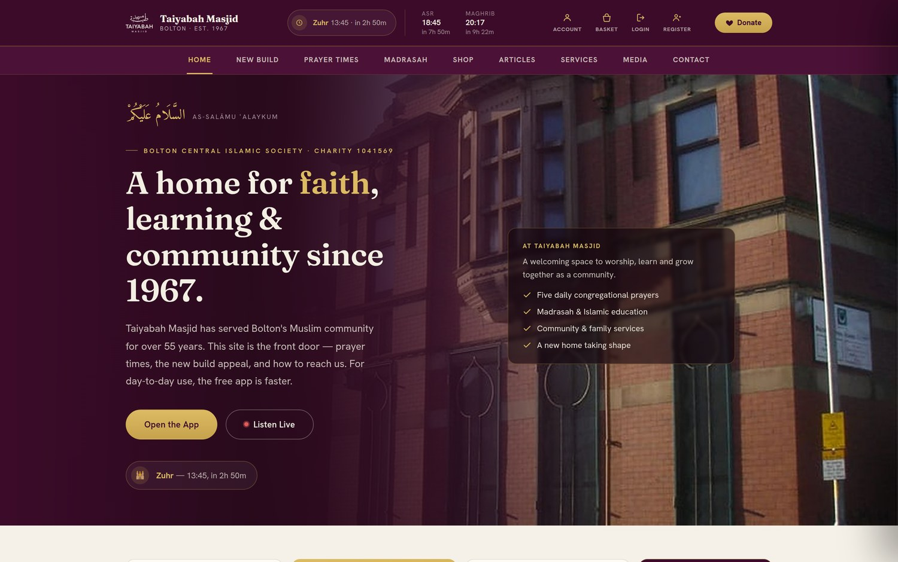
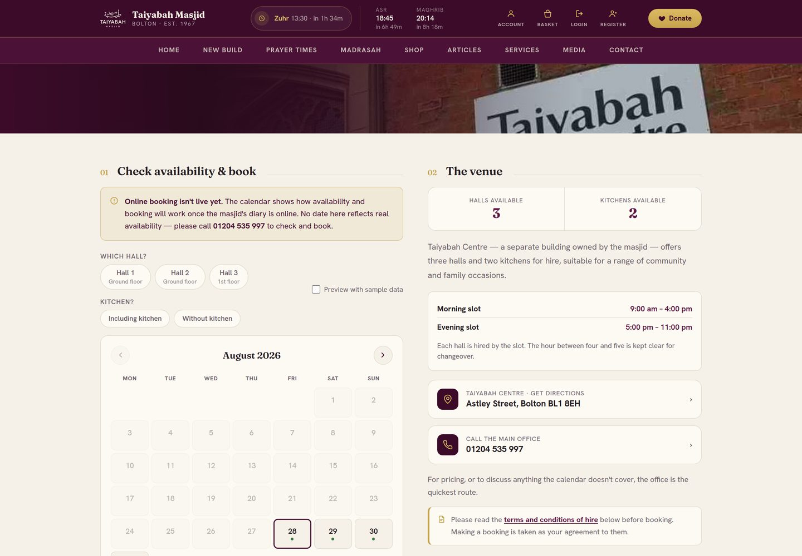
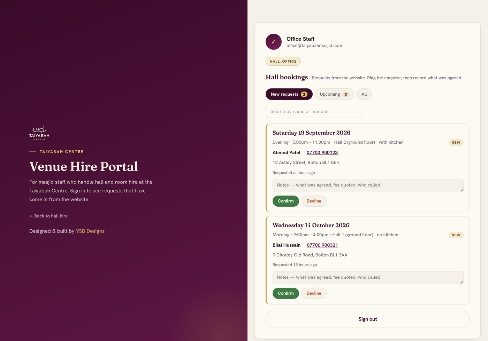

# Taiyabah Masjid — Website, Accounts & Staff Portals

**Prayer times, the new build appeal and donations, community information,
madrasah admissions and a holiday planner, adult courses, hall hire bookings,
Nikāḥ date requests, visitor accounts and two staff portals for Taiyabah Masjid,
Bolton.**

Bolton Central Islamic Society · Registered charity 1041569 · 31a Draycott Street, Bolton BL1 8HD



## What this is

Taiyabah Masjid has served Bolton's Muslim community since 1967 — one of the
first masjids in the city. This repository holds five things:

| | |
|---|---|
| **The public website** | Prayer times, the new build appeal and donations, services, the madrasah, hall hire with online booking, and contact details. |
| **`account/`** | Where a visitor registers, confirms their email and signs in. Public-facing, ready for the shop and the membership area. |
| **`portal/`** | The **Madrasah Portal** — authenticated, for parents, teaching staff and administrators. Reached from the Madrasah page. |
| **`venue/`** | The **Venue Hire Portal** — authenticated, for the office staff who handle bookings at the Taiyabah Centre. Reached from the Hall Hire page. |
| **`apply/`** | The **madrasah application form**. Finished and tested, and deliberately **not deployed** — see [Things behind a switch](#things-behind-a-switch). |

All three sign-in areas share one Supabase project, one set of accounts and one
two-factor setup, but a person only sees what their role allows.

> **The site is not live yet.** `robots.txt` currently blocks all search
> engines. See [Launch day](#launch-day) before that changes.

---

## Repository layout

```
index_template.html     the SOURCE of the website — edit this, never index.html
404_template.html       the source of the 404 page
build.py                substitutes {{PLACEHOLDERS}} -> writes index.html and 404.html
verify_structure.py     static checks; run BEFORE build.py, every time
index.html              GENERATED. Do not edit by hand.
404.html                GENERATED. Do not edit by hand.

robots.txt              currently blocks all crawlers (staging)
robots.live.txt         rename to robots.txt on launch day
sitemap.xml
og-image.jpg            link preview picture — must sit in the web ROOT

account/                Visitor accounts  (index.html, app.js, config.js)
portal/                 Madrasah Portal   (index.html, app.js, config.js)
venue/                  Venue Hire Portal (index.html, app.js, config.js)
assets/                 MUST be uploaded — see DEPLOY.md
  img/                  every photograph (33 files, 3.1 MB), generated by
                        optimise-images.py, fetched only when its page opens
  fonts/                amiri.woff2 — the Arabic face, served as a file
optimise-images.py      base64 sources -> img/. Run when an image changes
apply/                  Madrasah application form — NOT uploaded, see DEPLOY.md
build-inputs/           the 44 files build.py reads: fonts, compressed photos,
                        the prayer timetable, QR codes. Committed, so a fresh
                        clone can rebuild the site.
db/                     migrations 008-010 and their local test harness

DEPLOY.md               what gets uploaded and what never does
DONATIONS.md            the Stripe setup, and why Gift Aid is not on the site
brand/                  logo and icon files for Stripe, and the script that
                        generates them from assets/ — never uploaded
docs/                   screenshots for this README — never uploaded
```

`DEPLOY.md` is the file to read before putting anything on a server. Roughly half
of what is in this repository is source and tooling that must **not** be
uploaded.

### Building

```bash
python3 verify_structure.py && python3 build.py     # every time
python3 optimise-images.py                          # only when an image changed
```

`verify_structure.py` exists because a single missing `</div>` once left seven
pages nested inside another one — the navigation highlighted correctly, the URL
changed, and nothing rendered. It checks div balance per page and document-wide,
dead `data-nav` targets, unresolved anchors, duplicate ids, and placeholders the
template uses that `build.py` does not define. **Exit 0 is clean.**

It also prints a loud, unmissable banner for two things that would otherwise
ship silently and cost the masjid money: a donate link still pointing at the old
WordPress site, and a Stripe link containing `test_`. A test-mode link is a
complete, convincing checkout that takes nothing at all, and nothing on screen
would tell you. Neither is fatal — the build still runs, so the site can be
previewed — but you will not forget.

Fonts and a handful of small always-needed graphics — the favicon, the header
logo, the QR codes, two girih tiles — are base64 data URIs substituted at build
time from `build-inputs/`. **Photographs are not.** They are files under
`img/`, referenced by path and marked `loading="lazy"`, so a browser
fetches one only when the page using it is actually shown.

Nothing is fetched from another server at runtime either way.

Those inputs used to be read from `/tmp`, which meant the "edit the template and
rebuild" rule only worked on the one machine that still had the temp files — a
fresh clone could not rebuild the site at all, and the generated `index.html`
was the only real copy. They are committed now, and the way to check that claim
is still true is to make it fail:

```bash
rm index.html 404.html && python3 verify_structure.py && python3 build.py
```

Both files should come back byte-identical.

---

## Tech stack

| Layer | What's used | Why |
| --- | --- | --- |
| **Frontend** | HTML5, CSS3, vanilla JavaScript | No framework and no bundler. One self-contained file a browser runs directly — fewer moving parts on a site a volunteer may have to edit years from now |
| **CSS** | Custom properties, Grid, Flexbox, `clamp()` fluid type | One layout from a 390px phone to a desktop with no breakpoint sprawl. Verified: zero horizontal overflow on all 27 pages |
| **Routing** | Hash-based, single document | Every page is one HTTP response. No server, no router library, and the whole site works from a file:// URL |
| **Build** | Python 3, standard library only | Substitutes `{{PLACEHOLDER}}` tokens into the template. `verify_structure.py` runs first and refuses to build a broken document |
| **Typography** | Fraunces, Hanken Grotesk, Amiri — self-hosted woff2 | Google Fonts would send every visitor's IP to Google before they consented. Subset with fontTools; Arabic keeps its full shaping tables |
| **Images** | Pillow — resize, progressive JPEG, files under `img/` | Each photograph is fetched only when its page is opened. Inlining them all made the document 10.3 MB; first load is now about 615 KB |
| **Backend** | Supabase — Postgres 15, GoTrue auth, PostgREST | Managed Postgres in **London**, so booking data never leaves the UK |
| **Access control** | Row Level Security + column-level `GRANT` | The anon key can insert seven named columns and cannot read a single row back. Office staff can change three columns and no others |
| **Authentication** | Supabase Auth with TOTP two-factor | Roles live in their own table, never on the user's own row, so nobody can promote themselves |
| **Notifications** | Supabase Edge Functions (Deno) + Resend | A booking that arrives on a Friday night should not wait until Tuesday |
| **Payments** | Stripe Payment Links | Donations are four fixed tiers plus a donor-chooses amount. No server code and no card data anywhere near this repository — Stripe hosts the checkout |
| **Testing** | Playwright (Python) for the browser, `psql` for the database | Policies are proved against a real Postgres with a Supabase stub *before* they reach the live project |
| **Hosting** | Any static host | The built files are uploaded to the web root; there is no server-side anything. See `DEPLOY.md` for exactly which files |

## What it looks like

**Hall hire** — real availability read from the database, two sessions a day, a
twelve-month horizon, and terms that must be agreed before a slot unlocks.



**The venue portal** — where the office works through requests. Staff signed in
here can see bookings and provably nothing else; they may change a request's
status and notes, but never the applicant's own details.



## Engineering notes

Each of these came from something that actually went wrong.

**Almost nothing reaches another company.** The site sets no cookies, carries no
analytics and embeds no third-party widget — fonts are self-hosted and the Google
Maps iframe was replaced with an address card. Two pages reach outside, and both
are named in the privacy notice: hall hire asks the booking database (ours,
hosted in London) which dates are taken, deferred so that reading the prayer
times contacts nobody; and the media page loads each video's still image from
YouTube, sent with `referrerpolicy="no-referrer"` and `loading="lazy"`. The
masjid chose that trade-off knowingly — plain cards read as broken. All of this
is asserted by a test against the rendered page, so a change that reintroduces a
tracker fails the build rather than the privacy notice.

**A structural checker that runs before every build.** One missing `</div>`
once left seven pages nested inside another. Navigation highlighted correctly,
the URL changed, and nothing rendered — because the pages were still in the DOM,
which is exactly what the tests were checking. `verify_structure.py` now checks
div balance per page and document-wide, dead `data-nav` targets, unresolved
anchors, duplicate ids, and placeholders `build.py` does not define.

**Special category data that is asked for and then thrown away.** The booking
form asks whether the enquirer is a masjid member, because that decides the rate
quoted. Membership of a mosque discloses religious belief — Article 9 data. The
answer is used on screen and never transmitted; the resulting price is withheld
too, since with two possible figures storing one would disclose the answer just
as plainly.

**Least privilege between two audiences sharing one login system.** Venue office
staff and madrasah staff sign in through the same Supabase project, but a
`hall_office` role sees bookings and provably nothing else — a test asserts they
can read zero other profiles and zero other role rows.

**Failing honestly when the truth is unknown.** If availability cannot be
fetched, every date stays "unknown" rather than claiming to be free. If a
booking cannot be submitted, the screen says so and gives the office number
instead of showing a false confirmation. Both paths are tested by aborting the
request.

**Tests that ask the right question.** Three bugs shipped because tests checked
the DOM rather than what a person can see. The suite now attaches
`page.on("pageerror")` (console listeners do not catch uncaught exceptions),
navigates by clicking real links rather than calling the hoisted `showPage()`,
and asserts visibility and rendered height rather than presence.

**A menu that was slid away but not hidden.** The burger drawer was moved
off-screen with `transform` alone, which leaves its twenty links focusable and in
the accessibility tree — a keyboard user tabbing across the header fell into a
menu they could not see. It now sets `visibility:hidden` when closed, with the
flip delayed to the end of the slide so nothing blinks out mid-animation. Fixing
that broke focus-into-menu on open, because a hidden element cannot take focus;
the test caught it in the same run.

**Reaching the account area at all.** Account, Basket, Login and Register
appeared only at 1340px and up, and the drawer had no account link — so on every
phone, every tablet and every laptop window below 1340px there was no route to
`account/` from anywhere on the site. The header controls now appear from 1080px,
exactly where the burger disappears, and the drawer carries the same four. A test
opens the site at thirteen widths and fails if no account link is on screen.

**Transparent artwork disappears on a matching background.** The Stripe logo was
supplied as plum-on-transparent, the masjid set the checkout background to plum,
and the result was an invisible logo that looked like a failed upload. `brand/`
now ships both inks and names the files for the *background* they belong on
rather than for their own colour.

---

## The database

Migrations live in a separate directory and are applied by pasting them into the
Supabase SQL editor, in order.

| Migration | What it does |
|---|---|
| `001_foundation.sql` | Roles, profiles, `has_role()`, `is_admin()`, RLS, audit table |
| `002_grants.sql` | Table privileges for `authenticated` |
| `003_hall_bookings.sql` | The bookings table, flood control, retention function |
| `004_hall_office_role.sql` | The `hall_office` role — **run in two parts** |
| `005_availability_by_hall.sql` | Superseded by 006; keep for history |
| `006_halls_and_kitchen.sql` | Named halls, the kitchen option, whole-venue availability |
| `007_retention_and_cleanup.sql` | Schedules the deletion job, drops `whoami()` |
| `008_admissions.sql` | Madrasah applications. **Not applied** — see below |
| `009_courses.sql` | Adult courses and their sign-ups. **Not applied** |
| `010_nikah_requests.sql` | Nikāḥ date requests. **Not applied** |

`STAFF_give_someone_a_role.sql` is the one you will reuse — it grants a role to
an account by email address and prints the full staff list.

Files beginning `_test_` are **local only**. They insert junk rows and call
`set role`. Never run one against Supabase. `_test_supabase_stub.sql` (and
`db/_test_stubs.sql` for 008-010) recreates enough of Supabase on a throwaway
Postgres to prove policies before they ship.

Every harness in `db/` reassigns table ownership to a `NOSUPERUSER NOBYPASSRLS`
role before asserting anything. Skip that and the tests run as a superuser,
which ignores RLS — and a broken policy set passes. That is not hypothetical:
it is how both of the failures above got as far as they did.

### Four rules that were learned the hard way

**GRANT and RLS are different things and you need both.** Postgres checks table
privileges *before* it evaluates any policy. Migration 002 shipped with policies
but no grants, and every signed-in query failed with `permission denied`.

**`INSERT … RETURNING` is checked against the SELECT policies.** With
`FORCE ROW LEVEL SECURITY` on and no read policy for the function's owner, a
`SECURITY DEFINER` insert that used `returning id into …` failed with *"new row
violates row-level security policy"* — pointing at the WITH CHECK clause, which
was fine. It passed locally at first because the objects were owned by a
superuser, and a superuser ignores RLS entirely. Generate the uuid in the
function instead, and keep the read gate shut.

**A count inside a `SECURITY DEFINER` function returns nothing under FORCE.**
Same trap, worse symptom: no error at all. The fifteen-place cap on the adult
courses silently counted zero every time and handed out unlimited places. `009`
and `010` therefore enable RLS but do **not** force it, with the reasoning
written above the line so nobody "tidies" it to match `008`. Anon still holds no
privileges on those tables, so nothing is weaker.

**Blanket default privileges are a foot-gun.** Migration 002 ends with
`alter default privileges … grant … on tables to authenticated`, which applies
to tables created *afterwards*. `hall_bookings` therefore arrived with DELETE
and unrestricted INSERT for every signed-in user. RLS held, so nothing leaked,
but migration 006 takes those privileges back explicitly. Check the grants on
any new table rather than assuming.

---

## Hall bookings

1. Someone fills in the form on the Hall Hire page.
2. The request is inserted into `hall_bookings` with status `new`. The anon key
   can insert seven named columns and **cannot read a single row back**.
3. Office staff see it in `venue/`, ring the enquirer, and confirm or decline.
   They may only change `status`, `office_notes` and `handled_at` — never the
   applicant's name, address or requested date.
4. A **confirmed** booking closes that session for everyone, whichever hall it
   was for. The public calendar reads `hall_availability`, a view containing
   nothing but a date and a session.

### What is deliberately not stored

The form asks whether the enquirer is a member of the masjid, because the answer
decides which rate they are quoted. **That answer is never transmitted or
stored**, and neither is the resulting price. Membership of a mosque discloses
religious belief, which is special category data under Article 9 of the UK GDPR;
with only two possible prices, storing one would disclose the answer just as
plainly.

The consequence the office must know: when they ring back, they cannot see which
rate the website quoted. They quote it themselves.

### Retention

`purge_old_hall_bookings()` deletes requests six months after the event date, and
declined or cancelled ones after three. Migration 007 puts it on a weekly
schedule. **Those periods are also written into the privacy notice on the
website** — change one and you must change all three.

---

## Donations

Four fixed tiers (£250 / £500 / £1,000 / £5,000) plus one link where the donor
sets the amount, all **Stripe Payment Links**. The five `href`s live in the
`.nb-give-card` block on the New Build page and are the whole integration —
there is no server code, no webhook and no secret key. Bank transfer details sit
directly beneath them and cost the masjid nothing.

They replaced five WooCommerce links on the masjid's old WordPress site, which
would have become 404s the moment the domain moved — while still looking
perfectly fine on screen. `verify_structure.py` now guards against both that and
test-mode links; see `DONATIONS.md` for the Stripe settings.

### Two claims that were taken off the page

**Gift Aid.** The donate card used to promise *"add Gift Aid — 25p to every £1"*.
Stripe cannot produce or store a valid HMRC declaration, so the promise came off
rather than being made and not kept. Gift Aid is off the *page*, not off the
table: the masjid can still claim on bank transfers, standing orders and cash
with a declaration held at the office.

**"100% Donation Policy."** Card payments carry a processing fee, so it was not
true. The tick on the home page now reads *Registered charity 1041569*, which is
verifiable.

Neither claim can drift back: a test walks all 23 pages plus the header, drawer
and footer looking for both phrases.

---

## Navigation

The whole site is one document, so "pages" are `.page[data-page]` blocks toggled
by `showPage()`. Two things about that are worth knowing before changing it.

**Back means *up*, not *previously*.** Every child page carries a `.back-link` at
the top pointing at its parent — *‹ Services*, *‹ Birth, Marriage & Death*. All
eight child pages have one and all twelve top-level pages deliberately do not; a
test checks every one and that clicking it lands on the right parent.

A floating "Back" button was tried and removed. It followed browser history
rather than the site's structure, so arriving back at Home still counted as
"you can go back" and it appeared on the front page.

**The browser's own back button works.** Navigation calls `history.pushState`,
and a `popstate` listener restores the page. It used to call `replaceState`,
which overwrites the current entry instead of adding one — so the back button
and the back gesture on a phone did nothing between pages, or dumped the visitor
off the site entirely. That was the real bug; the floating control was a bad
answer to it.

---

## Privacy

The site sets **no cookies**, uses no analytics, and carries no advertising or
tracking. Fonts are self-hosted and the Google Maps embed was replaced with an
address card, so no page loads a third-party script, iframe or font.

Exactly one third party is contacted, on exactly one page: the **media** page
loads each video's still image from `i.ytimg.com`, which means Google sees a
visitor's IP address there. The requests carry no referrer and are lazy-loaded,
and the privacy notice states this plainly rather than claiming otherwise.
Everything else that reaches another company does so only when a visitor
chooses to click it.

This is asserted by an automated test against the rendered page, not just
believed. If a future change contacts a host other than the masjid's own
Supabase project or YouTube's image host, that test fails.

**The 404 page counts too.** It was still pulling Fraunces and Hanken Grotesk
from Google Fonts long after every other page had them built in — quietly
contradicting the notice. Its fonts are now inlined and it is generated by
`build.py` from `404_template.html`, so it cannot drift back.

The privacy notice lives at the `privacy` page and is linked from the footer.

---

## Security

- **Only the anon (publishable) key ever reaches a browser.** It is safe to
  commit. RLS is the real boundary.
- **The `service_role` key must never appear in this repo**, in any file, ever.
  If GitHub secret scanning blocks a push, do **not** click "Allow secret" —
  cancel, remove the key, and rotate it in Supabase.
- **Roles live in their own table**, never as a column on `profiles`, so a user
  cannot promote themselves by updating their own row.
- **`hall_office` cannot reach madrasah data.** Venue staff see bookings and
  nothing else — proved by a test that asserts they see zero other profiles.
- **Keep two administrators.** Deleting the only admin account destroys its
  roles and profile by cascade, and nobody can then grant the role back.

---

## Things behind a switch

Three features are finished, tested, and deliberately not switched on. Each
writes personal data to the masjid's own database, and the compliance work has
to land first — see `DEPLOY.md` for the full pre-flight list on each.

| Feature | Where | Switch | Migration |
|---|---|---|---|
| Madrasah application form | `apply/` | not in the upload zip | `008_admissions.sql` |
| Course sign-ups (Arabic, Ghusl) | Education pages | `REGISTRATION_OPEN` | `009_courses.sql` |
| Nikāḥ date requests | Marriage page | `REQUESTS_OPEN` | `010_nikah_requests.sql` |

**Apply the migration before flipping the switch, never the other way round.**
With the switch on and the tables missing, a visitor fills in a form and is
handed an error — which is worse than the honest "ring the office" they see now.

The three are not equally gated. `008` holds children's medical conditions,
SEND and EHCP status: Article 9 data, and the DPIA has to be finished first.
`009` and `010` hold adults' names, emails and phone numbers — still personal
data needing ICO registration, a lawful basis, a retention period and a line in
the privacy notice, but a much shorter conversation. Do not treat them as one
job.

Every one of these forms shows the office phone number in the meantime, and says
plainly that online submission is not live yet.

---

## Testing

Browser tests use Playwright. Three habits, each from a bug that shipped:

- **Attach `page.on("pageerror")`.** Console listeners do not catch uncaught
  exceptions. A null reference once killed the whole script block, including the
  navigation binding, and the tests passed.
- **Navigate by clicking real links**, never by calling `showPage()`. That
  function is hoisted, so it works even when the click handler is broken.
- **Assert what is visible**, not what is in the DOM. `text_content` reads
  hidden nodes, so a block that rendered on the wrong page still passed.

The suite is a set of standalone scripts rather than a framework. Each one prints
PASS/FAIL lines and exits non-zero on failure, so any of them can be run alone
while working on that area:

| Covers | Asserts, in short |
|---|---|
| Full-site sweep | every page renders with real height, no broken images, no dead nav targets, no cookies, no console errors, no overflow at 390 / 768 / 1440 |
| Donations | each tier reaches its own Stripe link, exactly five distinct links, **none in test mode**, no `/product/` link surviving, bank details untouched |
| Unbackable claims | "Gift Aid" and "100% donation" appear on no page, and not in the header, drawer or footer |
| Account reachability | an account link is on screen at thirteen widths from 360px to 1920px, signed in and signed out |
| Back navigation | all eight child pages link to the right parent, all twelve top-level pages have none, browser back/forward still work |
| Drawer | eleven sections with icons and no numbers, 44px tap targets, no focusable controls while closed |
| Hall hire | availability, hall and kitchen both mandatory, the whole-venue rule, URL normalisation |
| Privacy | no third-party fonts, only `i.ytimg.com` loaded from elsewhere, every thumbnail lazy and referrer-free |
| Link previews | Open Graph tags present, image 1200×630 and under WhatsApp's fetch limit |
| Articles | four articles reachable from the hub, heroes and thumbnails load, cross-links resolve |
| Madrasah admissions | fees, times and rules on the page, no unconfirmed dates published, form stays dark |
| Holiday planner | twelve month grids, closures painted, every Islamic date tagged as an estimate, "closed today" correct against a fixed clock |
| Education | tiles reach both course pages, forms hidden while closed, place cap and waiting list wording |
| Nikāḥ requests | two weeks' notice enforced, **no availability colouring anywhere**, prayer times read from the masjid's own timetable, Saturday 11am offered only on Saturdays, first and second choice, request wording never promises a booking |
| Venue portal | hall bookings and nikāḥ requests in one list, each write going to its own table and its own timestamp column, and no error shown to the office when the nikāḥ table has not been created yet |

Two of those assert an absence rather than a presence, which is the point:
nothing may publish a date the masjid has not confirmed, and nothing may paint a
nikāḥ day as free when the site has no idea whether it is.

Database policies are proved separately, against a throwaway Postgres with
`_test_supabase_stub.sql` standing in for Supabase, before anything reaches the
live project.

---

## Launch day

In this order:

1. **Decide what happens to the madrasah form preview link.** The Admissions
   page links to `apply/`, labelled as a preview. That is fine on the staging
   address, where crawlers are blocked and the form says it will not send
   anything. It is not fine on the public domain. Either finish the `008`
   pre-flight list and make the link a real Apply button, or take the link out.
   Do not skip this one — it is the item most likely to be forgotten.
2. Upload the files listed in `DEPLOY.md` to the web root. `og-image.jpg` must
   sit in the root itself — the site refers to it by absolute address, and one
   folder deeper means every shared link loses its picture.
3. Point `taiyabahmasjid.com` at this site. The canonical tag and sitemap
   already name that domain.
4. **Delete `robots.txt` and rename `robots.live.txt` to `robots.txt`.** Miss
   this and the site works perfectly but never appears in Google. Doing it
   *before* step 2 lets Google index the temporary address, after which the old
   and new sites compete with each other.
5. Update `PORTAL_URL` in the Edge Function settings, and the QR code if the app
   has moved to its own domain by then.

The donate links need nothing on launch day — they already point at Stripe, not
at the old site.

---

## Page weight

The document used to contain every photograph, base64-encoded. It reached
10.3 MB, which is roughly six seconds before anything appears on a typical UK
4G connection — on a site whose audience is overwhelmingly on phones.

| | before | after |
|---|---|---|
| `index.html` | 10.3 MB | 622 KB (253 KB gzipped) |
| photographs in the document | 9.0 MB | none |
| **first load, home page** | **~10.5 MB** | **~615 KB** |
| requests on first load | 1 | 7 |
| images fetched before you navigate anywhere | all 33 | 5 |

Three separate things were wrong, and all three are worth knowing about
because they come back:

**Base64 costs 33% before you start.** Encoding a 300 KB photograph into the
document writes 400 KB, and gzip cannot compress it back because JPEG data is
already compressed. That overhead applies to every image on every page load.

**Several images were simply too large.** The Shop masthead was 1800×2700 at
2.1 MB — a photograph rendered behind a 50%-opacity scrim in a banner about
480 px tall. `optimise-images.py` caps each image by role: 1400 px for
mastheads, 800 px for cards, 700 px for the phone screenshots. Nothing is
cropped and no aspect ratio changes, so every `object-fit` and
`object-position` rule behaves exactly as it did. The Shop masthead is now
341 KB and looks identical.

**Everything loaded whether it was needed or not.** Every page lives in the
same document, so a visitor reading the prayer times had already downloaded the
shop, the articles and the madrasah. The images are `loading="lazy"` now, and
the pages are `display:none` until navigated to, so a browser fetches an image
only when its page is actually shown. The home page hero is the deliberate
exception — `fetchpriority="high"`, no lazy attribute, because it is the first
thing anyone sees.

The Arabic typeface moved out too. Amiri is 74 KB and was 100 KB of
incompressible base64 in every copy of the document; as `fonts/amiri.woff2`
it is cached across deploys instead of being re-downloaded every time the HTML
changes. Fraunces and Hanken Grotesk stay inline, because they set every word
on the site and a separate request would show a flash of fallback text.

**What was deliberately not done:** WebP. It would be roughly 25% smaller
again, but it is a compatibility bet — Safari only gained it in 2020 — and the
win here came from not shipping the images at all until they are needed, not
from the codec. Changing `FORMAT` in `optimise-images.py` is a one-line
decision if someone later decides the trade is worth it.

---

## Known limitations

- **The site is no longer one self-contained file.** That was the point — see
  [Page weight](#page-weight) — but it means `index.html` alone is not the
  website. Upload it without `img/` and every page loads, reads
  correctly, and shows a broken icon where each photograph should be.
  `build.py` refuses to build if a photograph is missing locally, which catches
  it before it ships, but nothing can catch a folder left out of the upload.
- **`assets/` is committed as `Assets/` with a capital A.** GitHub Pages serves
  from a case-sensitive filesystem, so `assets/logo-cream.png` 404s. The 404
  page now points at the copies in the web root instead, which do not depend on
  how that folder happens to be capitalised. Worth renaming properly one day.
- **Several published figures are still unconfirmed by the masjid**: the
  madrasah academic year, date-of-birth windows and deadline in
  `apply/config.js`; which evening the Arabic class runs; the place cap on the
  Ghusl workshop; and whether either course has a fee. The pages are written so
  that nothing unconfirmed is stated as fact, but they are thinner than they
  should be until those answers come back.
- **The office is not emailed when a request arrives.** Hall bookings and nikāḥ
  requests both land silently in the venue portal, so somebody has to look at
  it. Sending email needs a verified domain and DNS records; until that is done
  the portal is the only notification there is.
- **The prayer timetable holds 2026 only.** It degrades honestly — the header
  falls back to "open the app" — but it needs the 2027 timetable before
  1 January 2027.
- **Hall hire prices are still marked as placeholders in the code**
  (`member 100/120`, `non-member 150/180`) and the calculation runs in the
  browser, so both tiers are readable via View Source. The masjid has been asked
  to confirm or correct the figures.
- **The funerals page carries no prices at all.** The masjid has been asked what
  to publish, member and non-member.
- **The Imams' Advice form does not send anything itself.** It hands the message
  to the visitor's own email app via `mailto:` — so the visitor must still press
  send, and a device with no mail app configured does nothing at all. The wording
  on the page says both of those plainly rather than promising delivery. Phase 2
  replaces it with an Edge Function that emails the office and stores nothing:
  deliberately *not* a database table, because "ask the imam" collects marital,
  health and bereavement matters that would be Article 9 data the moment they
  were written down.
- **Booking emails are not connected.** The Edge Function is written and tested;
  it needs a verified sending domain. Until then a request waits in the portal.
- **The app is still served from a personal GitHub Pages address**, which the QR
  code and five links resolve to.
- **The notification function always replies OK to Supabase, even on failure.**
  That prevents a retry loop emailing the office repeatedly, but it means a
  silent failure stays silent. Send a test booking every few months.
- **YouTube thumbnails are blocked by some ad blockers.** `i.ytimg.com` is on
  several tracker blocklists, so a visitor running uBlock Origin or Brave sees
  the plum fallback panel rather than the video still. Inlining the twelve images
  would remove the dependency entirely and restore the zero-third-party position.

---

## About this project

Part of a wider *Taiyabah Masjid — Complete Overhaul*, alongside the
[prayer times app](https://github.com/yameenbux/Taiyabah-Mosque-App) and the
[home smart screen](https://github.com/yameenbux/Taiyabah-Masjid-HomeSmartScreen).
Branding, fonts and prayer data are shared with those sibling repositories
rather than reinvented here.

## Credits

Built for Bolton Central Islamic Society. The Taiyabah Masjid name, the masjid's
logo and the prayer timetable belong to the charity — the timetable is the
masjid's own published times, not calculated by this site and not taken from a
third-party aggregator.

Typefaces are [Fraunces](https://github.com/undercasetype/Fraunces),
[Hanken Grotesk](https://github.com/globalfoundries/HankenGrotesk) and
[Amiri](https://github.com/aliftype/amiri), all under the SIL Open Font License
1.1, self-hosted here as that licence expressly permits. Photography of the
masjid and the new build was supplied by the masjid. Shop category images are
stock photography standing in until the masjid's own product photographs are
available.

Bolton Council of Mosques contact details on the funeral services page were
taken from BCoM's own published information and **confirmed with the masjid on
28 August 2026**.

Designed and built by **[YSB Designs](https://ysbdesigns.uk)**.
